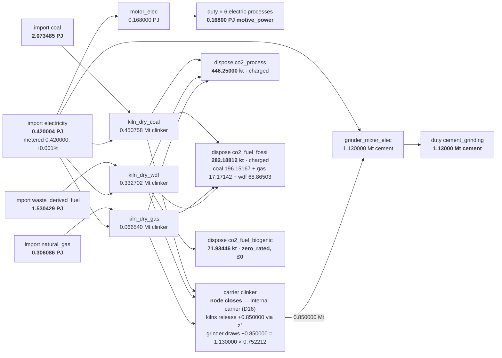
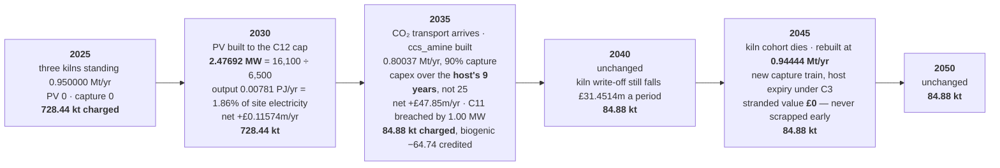
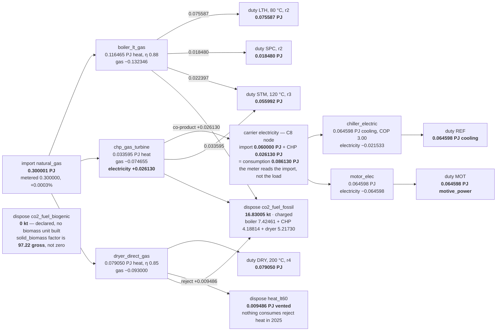
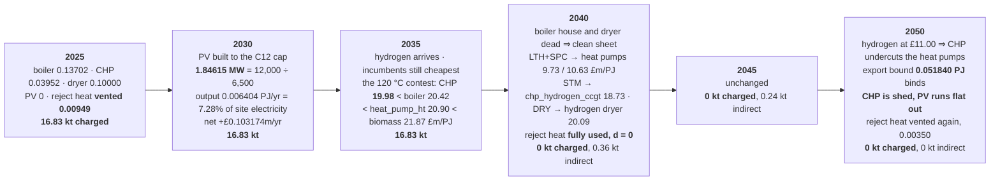

# 19 — The worked examples as diagrams

The two worked examples —
[cement](../specs/2026-08-28-carb3-site-energy-system-worked-example-cement.md) and
[food and drink](../specs/2026-08-28-carb3-site-energy-system-worked-example-food-drink.md) —
carry every number in prose and tables. This note carries the same numbers as pictures: which
data table holds what, what value it holds at each premise, and where that value goes.

**Nothing here is new.** Every figure is lifted from the two worked examples and every one of
them is illustrative, not a citation. Where the two disagree with this note, the worked examples
win.

**This file is hand-written and is not generator output.** The generated diagrams live in
[`docs/specs/diagrams/`](../specs/diagrams/) and
[`docs/specs/archive/diagrams/`](../specs/archive/diagrams/) and are built by
`examples/build_spec_flow_diagram.py`; those must never be hand-edited. This one has no
generator and no `--check`, so its numbers can go stale — the worked examples are the source.

Section references without a document name are to the
[implementation specification](../specs/2026-08-28-carb3-site-energy-system-implementation.md).
Labels carry their meaning in brackets on first use, per the house rule.

---

## 1. The shape both examples share

The same thirteen sections, the same nine algorithms, the same entities. Only the values differ.

```mermaid
flowchart LR
  subgraph PREMISE["What the premise supplies"]
    direction TB
    PR["premise_record §3.1"]
    PE["premise_energy §3.1.1"]
    PT["premise_throughput §3.1.2"]
    PC["premise_connection §3.1.3"]
    PD["premise_process_detail §3.10"]
    PU["premise_process_unit §3.10.2"]
    PV["premise_process_vintage §3.15"]
    PM["premise_measured_emissions §3.11"]
    PO["premise_operating_profile §3.12"]
  end

  subgraph REF["Reference data, shared across all premises"]
    direction TB
    RC["carrier §3.4"]
    RU["unit §3.5"]
    RE["unit_eligibility §3.5.1"]
    RH["unit_abatement_host §3.5.3"]
    RK["unit_carrier_coefficient §3.6"]
    RD["process_duty §3.9"]
    RS["activity_process_energy_share §3.3.1"]
    RA["activity_default_unit §3.16"]
    RL["process_load_shape §3.13"]
  end

  subgraph SCEN["What the scenario supplies"]
    direction TB
    SI["infrastructure_scenario §3.7"]
    SP["scenario_parameters §3.8"]
  end

  A1["A1 ingest and validate"]
  A2["A2 duties and candidate units"]
  A3["A3 allocate energy onto carriers"]
  A4["A4 back-solve capacity, mix, vintage"]
  A5["A5 apply the scenario"]
  A6["A6 build the problem"]
  A7["A7 solve"]
  A8["A8 output rows and evidence tiers"]
  A9["A9 roll up to GB"]

  PREMISE --> A1 --> A2 --> A3 --> A4 --> A5 --> A6 --> A7 --> A8 --> A9
  REF --> A2
  REF --> A4
  REF --> A6
  SCEN --> A5
```

The four evidence tiers that travel with every output row — `process_evidence_tier`,
`mix_evidence_tier`, `year_evidence_tier`, `area_evidence_tier` — are set by `A1`–`A4` and
never averaged into one score. The two examples land on **different tiers for the same field**,
which is §4 of this note.

---

## 2. Cement — the tables and the values in them

**Premise `P-000123`, `Cement Works`, England, base year 2024.** The parity case: mass duties,
a co-firing kiln split three ways by fuel under `D13` (one primary carrier per unit), and a
capture train arriving in 2035.

```mermaid
flowchart TB
  subgraph PREM["Premise-supplied — P-000123, Cement Works, base year 2024"]
    direction TB
    PR["<b>premise_record</b> §3.1<br/>floorspace 46,000 m²<br/>construction_year 1957<br/>no available_area ⇒ footprint proxy 16,100 m²<br/>area_evidence_tier = proxy"]
    PE["<b>premise_energy</b> §3.1.1 — 5 carriers<br/>coal 2.10000 · gas 0.31000 · elec 0.42000<br/>waste_derived_fuel 1.55000 from 2023 ⇒ substituted<br/>fuel_oil 0.00000 not_consumed<br/>solid_biomass absent ⇒ coverage incomplete<br/><b>total 4.38000 PJ/yr</b>"]
    PT["<b>premise_throughput</b> §3.1.2 — mass denominator<br/>clinker 0.85000 Mt/yr<br/>cement 1.13000 Mt/yr"]
    PC["<b>premise_connection</b> §3.1.3 — 2 rows<br/>C-01 electricity 25 MW imp / <b>0 MW exp</b> / 33 kV<br/>C-02 natural_gas 12 MW imp"]
    PD["<b>premise_process_detail</b> §3.10 — 9 rows, <b>no unit_id</b><br/>kiln_pyroprocessing 2004– , known_capacity 0.95 Mt/yr (the line)<br/>the other 8 processes from 1957<br/>process_evidence_tier = site_known"]
    PU["<b>premise_process_unit</b> §3.10.2 — 4 rows<br/>2004 line → kiln_dry_coal · kiln_dry_wdf · kiln_dry_gas<br/>1957–2003 line → kiln_wet_ICMCLK<br/>capacity_share blank ⇒ A4 splits 0.95 on the §5.2 mix"]
    PV["<b>premise_process_vintage</b> §3.15 — 3 cohorts, all 2004<br/>kiln_dry_coal 0.530303<br/>kiln_dry_wdf 0.391414<br/>kiln_dry_gas 0.078283"]
    PM["<b>premise_measured_emissions</b> §3.11<br/>2024 combustion 291 + process 452 = <b>743 kt</b><br/>base-year row present ⇒ §7.6 runs"]
    PO["<b>premise_operating_profile</b> §3.12<br/>continuous, 8,400 h/yr, 3 shutdown weeks<br/>peak_electricity 16.2 MW, load factor 0.82<br/>within_shift_peak_factor 1.17"]
    PL["<b>process_load_shape</b> §3.13 — 8 rows<br/>kiln flat 1.00 · packing intermittent 0.35<br/>2 standing rows run when idle"]
  end

  subgraph REF["Reference data this premise reaches"]
    direction TB
    RC["<b>carrier</b> §3.4 — 13 rows, <b>one gradeable: heat_lt60</b><br/>coal, natural_gas, waste_derived_fuel, fuel_oil, electricity<br/>motive_power, heat_lt60 · clinker (internal), cement (mass)<br/><b>co2_process, co2_fuel_fossil charged</b><br/><b>co2_fuel_biogenic zero_rated</b> · co2_captured"]
    RU["<b>unit</b> §3.5 — 15 rows, fuel in the identity (D13)<br/><b>no abates_unit_id</b><br/>kiln_dry_coal 260 £m/(Mt/yr), L 40, α 0.90<br/>kiln_dry_gas 252 · kiln_dry_wdf 274<br/>ccs_amine 190, L 25 · pv_rooftop 0.62 £m/MW, α 0.10<br/>battery_2h 0.58 £m/MW, L 15"]
    RH["<b>unit_abatement_host</b> §3.5.3 — 12 rows<br/>4 capture trains × the 3 dry kiln units<br/>life = <b>earliest</b> over the hosts, all 2004 here"]
    RK["<b>unit_carrier_coefficient</b> §3.6<br/>kiln_dry_coal: clinker +1.00000, coal −4.60000,<br/>electricity −0.10871, co2_process +0.52500,<br/>co2_fuel_fossil +435.16000 <i>derived</i><br/>kiln_dry_wdf splits 92.0 kt/PJ into<br/>+206.98712 fossil and +216.21288 biogenic"]
    RE["<b>unit_eligibility</b> §3.5.1<br/>min_duty 0.15 Mt/yr on the three kilns<br/>kiln_calcium_looping_coal 1.20 &gt; 0.85 ⇒ <b>screened out</b><br/>ccs_amine earliest_year 2035<br/>kiln_dry_wdf max_share 0.55"]
    RA["<b>activity_default_unit</b> §3.16<br/>kiln 0.53 / 0.39 / 0.08 across the three fuels<br/>grinder_mixer_elec 1.00 · motor_elec 1.00"]
    RS["<b>activity_process_energy_share</b> §3.3.1<br/>coal, gas, other, biomass → kiln 1.00<br/>electricity → grinding 0.38, raw grinding 0.24,<br/>kiln 0.22, and four smaller processes"]
  end

  subgraph SCEN["Scenario central, cluster humber"]
    direction TB
    SI["<b>infrastructure_scenario</b> §3.7<br/><b>co2_transport false → true at 2035</b>, £18.00m/Mt<br/>hydrogen <b>false throughout</b><br/>grid_headroom true throughout"]
    SP["<b>scenario_parameters</b> §3.8, £m per PJ<br/>coal 2.60→3.10 · gas 7.10→8.80<br/>waste_derived_fuel 1.00→1.50 · elec 32.00→23.50<br/>carbon £90→£275/t · elec factor 18.0→3.0 kt/PJ<br/>waste_derived_fuel factor <b>92.0 gross</b>, split by biogenic_fraction 0.5109"]
  end

  DUTY["<b>process_duty</b> §3.9 — 7 duties, no duty_family column<br/>cement_grinding → cement <b>1.13000 Mt/yr</b><br/>motive_power <b>0.16800 PJ/yr</b> over 6 processes<br/><b>kiln_pyroprocessing has no duty</b> — clinker is internal (D16)"]
  CAP["<b>A4 back-solved capacity</b><br/>kiln_dry_coal 0.503788 Mt/yr<br/>kiln_dry_wdf 0.371843 · kiln_dry_gas 0.074369<br/>sum 0.950000 = the permit kiln, utilisation 0.89474<br/>grinder 1.228261 Mt/yr · motor 0.176842 PJ/yr<br/>mix_evidence_tier = <b>carrier_bounded</b>"]
  LP["<b>A6 the LP</b><br/>14 units × 6 periods, 7 duties, 13 carriers, 2 connections<br/>C1 duty satisfaction: 7 × 6 = <b>42</b> rows<br/>kiln_calcium_looping_coal screened out, hydrogen units absent<br/>C10 cascade: <b>0 rows</b> — one gradeable carrier (heat_lt60), no pair to flow between<br/>C11 binds at C-01 from 2035 · C12 binds on PV"]

  PREM --> DUTY
  REF --> DUTY
  DUTY --> CAP
  SCEN --> LP
  CAP --> LP
```

### 2.1 The base year, 2025, as a balance

Every arrow is a value the LP determined rather than chose. C5 forbids building at $t_0$, so
this is the back-solved baseline at 2025 prices.

| Term, 2025 undiscounted | £m |
|---|---|
| $Z^{\text{capex}}$ — C5 forbids building at $t_0$ | 0.00000 |
| $Z^{\text{opex}}$ — kilns 4.03030 + 3.38377 + 0.56520 = 7.97928 (each unit's own rate), grinder 1.84239, motor 0.06189 | 9.88356 |
| $Z^{\text{fuel}}$ — coal 5.39106, gas 2.17321, WDF 1.53043, elec 13.44013 | 22.53483 |
| $Z^{\text{carbon}}$ — **on disposal**, 728.43812 kt × £90/t | 65.55943 |
| $Z^{\text{infra}}$, $Z^{\text{net}}$, $Z^{\text{exp}}$, $Z^{\text{strand}}$ | 0.00000 |
| **Total** | **£97.97782m** |

Direct emissions **728.43812 kt**, against a measured 743 kt — §7.6 reconciles to **1.96%**,
reported and not corrected. Indirect, reported and not charged: 0.420004 × 18.0 = **7.56007 kt**.

### 2.2 The pathway

**446.25 kt of the base year is calcination**, and no fuel switch touches it — only capture
does, and only 90% of it. That is why this premise's direct emissions floor at 84.88 kt rather
than at zero.

---

## 3. Food and drink — the tables and the values in them

**Premise `P-004417`, `Food Processing Centre`, England, base year 2024.** The mechanism case:
a milk-powder dairy, four graded heat carriers, four devices competing at one duty, and an
existing CHP the meter hides.

```mermaid
flowchart TB
  subgraph PREM["Premise-supplied — P-004417, Food Processing Centre, base year 2024"]
    direction TB
    PR["<b>premise_record</b> §3.1<br/>floorspace 18,400 m²<br/>construction_year absent<br/>construction_year_band 1965-1984 ⇒ read as <b>1965</b><br/>area supplied directly ⇒ area_evidence_tier = <b>measured</b>"]
    PE["<b>premise_energy</b> §3.1.1 — 5 carriers<br/>natural_gas 0.30000 · electricity 0.06000<br/>fuel_oil, coal, solid_biomass 0.00000 not_consumed<br/><b>coverage complete</b><br/><b>total 0.36000 PJ/yr</b> — but the meter nets the CHP"]
    PT["<b>premise_throughput</b> §3.1.2<br/><b>zero rows, and that is correct</b><br/>every process is energy-denominated under D5"]
    PC["<b>premise_connection</b> §3.1.3 — 2 rows<br/>E-01 electricity 4 MW imp / <b>2 MW exp</b> / 11 kV<br/>available_area <b>12,000 m²</b><br/>G-01 natural_gas 18 MW imp"]
    PD["<b>premise_process_detail</b> §3.10 — 6 rows<br/>direct_heating 2019– , known_capacity <b>0.10000 PJ/yr</b><br/>boiler_steam_hot_water names <b>no unit</b><br/>process_evidence_tier = site_known"]
    PV["<b>premise_process_vintage</b> §3.15 — 3 cohorts<br/>chp_gas_turbine 2011, share 0.35, dies <b>2035</b><br/>boiler_lt_gas 2016, share 0.65, dies <b>2035</b><br/>dryer_direct_gas 2019, share 1.00, dies <b>2038</b>"]
    PM["<b>premise_measured_emissions</b> §3.11<br/>2022 17.9 kt · 2023 17.3 kt<br/><b>no base-year row</b> ⇒ emissions_year_unmatched<br/>reported, never a rejection ⇒ §7.6 <b>skipped</b>"]
    PO["<b>premise_operating_profile</b> §3.12<br/>three_shift, 7,200 h/yr, 2 shutdown weeks<br/>peak_electricity 3.4 MW, load factor 0.56<br/>within_shift_peak_factor <b>1.47</b>"]
    PL["<b>process_load_shape</b> §3.13 — 6 rows<br/>boiler batch_cyclic 0.55, peak_to_mean 2.40<br/>refrigeration standing, <b>summer_weighted</b><br/>2 standing rows run when idle"]
  end

  subgraph REF["Reference data this premise reaches"]
    direction TB
    RC["<b>carrier</b> §3.4 — 14 rows, <b>4 gradeable</b><br/>heat_lt60 r1 · heat_60_100 r2<br/>heat_100_150 r3 · heat_150_400 r4<br/>motive_power, cooling intermediate<br/>co2_fuel_fossil charged · co2_fuel_biogenic zero_rated<br/><b>no co2_process at all</b>"]
    RU["<b>unit</b> §3.5 — 19 rows, fuel in the identity (D13)<br/>boiler_lt_gas 4.5 £m/(PJ/yr), grade_out 3<br/>boiler_lt_biomass <b>7.9</b>, α 0.82 — the D13 payoff<br/>heat_pump_lt_air 16.0, <b>grade_out 2</b><br/>heat_pump_ht 26.0, grade_out 3, grade_in_max 2<br/>chp_gas_turbine 38.0, L 25 · dryer_direct_gas 5.0, grade_out 4<br/>pv_rooftop 0.62 £m/MW, α 0.11, 6,500 m²/MW"]
    RK["<b>unit_carrier_coefficient</b> §3.6<br/>boiler_lt_gas: heat_100_150 +1.00000, gas −1.13636,<br/>co2_fuel_fossil +63.74980 <i>derived</i><br/>chp_gas_turbine: heat +1.00000, gas −2.22220,<br/><b>electricity +0.77780 co-product</b><br/>dryer_direct_gas: <b>heat_lt60 +0.12000 role=reject</b><br/>heat_pump_lt_reject: heat_lt60 −0.68750, COP 3.20"]
    RE["<b>unit_eligibility</b> §3.5.1<br/>boiler_lt_coal <b>max_share 0.00</b> — screened at this site<br/>chp_biomass_st min_duty 0.25 &gt; 0.07559 ⇒ <b>screened out</b><br/>hydrogen units earliest_year 2035<br/>heat_pump_ht earliest_year 2030"]
    RA["<b>activity_default_unit</b> §3.16 — <b>the entity this example turns on</b><br/>boiler_steam_hot_water STM: chp_gas_turbine <b>0.60</b><br/>evidence_tier sector_statistic, DUKES Table 7 / CHPQA<br/>boiler_lt_gas 0.40, derived, residual<br/>LTH and SPC: boiler_lt_gas 1.00"]
    RS["<b>activity_process_energy_share</b> §3.3.1<br/>gas → boiler 0.62, direct_heating 0.31, site_services 0.07<br/>elec → motors 0.45, refrigeration 0.25,<br/>site_services 0.20, compressed_air 0.10"]
  end

  subgraph SCEN["Scenario central, cluster mersey"]
    direction TB
    SI["<b>infrastructure_scenario</b> §3.7<br/><b>hydrogen false → true at 2035</b>, £0.90m/PJ<br/>co2_transport <b>false throughout</b><br/>grid_headroom true throughout"]
    SP["<b>scenario_parameters</b> §3.8, £m per PJ<br/>gas 7.10→8.80 · elec 32.00→23.50<br/>hydrogen <b>19.50→11.00</b> from 2035<br/>biomass 15.00→19.00 · export elec 19.00→13.50<br/>carbon £90→£275/t · elec factor 18.0→3.0 kt/PJ<br/>hydrogen factor <b>0.0</b> — a scenario assumption<br/>biomass factor <b>97.22 gross</b>, biogenic_fraction 1"]
  end

  DUTY["<b>process_duty</b> §3.9 — 6 duties, 4 of them graded heat<br/>LTH heat_60_100 r2 <b>0.075587 PJ/yr</b><br/>STM heat_100_150 r3 <b>0.055992 PJ/yr</b><br/>DRY heat_150_400 r4 <b>0.079050 PJ/yr</b><br/>SPC heat_60_100 r2 <b>0.018480 PJ/yr</b><br/>REF cooling <b>0.064598</b> · MOT motive_power <b>0.064598</b>"]
  CAP["<b>A4 back-solved capacity</b><br/>boiler_lt_gas 0.137018 PJ/yr, serving <b>three duties</b><br/>chp_gas_turbine 0.039524 · dryer 0.100000 known<br/>chiller 0.071776 · motor 0.067998<br/><b>consumption 0.086130 = import 0.060000 + CHP 0.026130</b><br/>mix_evidence_tier = <b>activity_default</b>, the weakest tier"]
  LP["<b>A6 the LP</b><br/>6 periods, 6 duties, 14 carriers, 2 connections<br/>chp_biomass_st screened out, hydrogen units held back to 2035<br/>C10 cascade: <b>36 h-variables</b>, 6 grade pairs × 6 periods<br/>C11 export leg binds at 2050 · C12 binds on PV"]

  PREM --> DUTY
  REF --> DUTY
  DUTY --> CAP
  SCEN --> LP
  CAP --> LP
```

### 3.1 The base year, 2025, as a balance

| Term, 2025 undiscounted | £m |
|---|---|
| $Z^{\text{capex}}$ — C5 forbids building at $t_0$ | 0.00000 |
| $Z^{\text{opex}}$ — boiler 0.024663, CHP 0.047429, dryer 0.021000, chiller 0.015791, motor 0.023799 | 0.13268 |
| $Z^{\text{fuel}}$ — gas 2.130007, electricity 1.920000 | 4.05001 |
| $Z^{\text{carbon}}$ — **on disposal**, 16.83005 kt × £90/t | 1.51470 |
| $Z^{\text{infra}}$, $Z^{\text{net}}$, $Z^{\text{exp}}$, $Z^{\text{strand}}$ | 0.00000 |
| **Total** | **£5.69739m** |

Direct emissions **16.83005 kt**, all natural gas, all vented. There is **nothing to reconcile
against** — no base-year measured row — so §7.6 is skipped and said to be skipped on every
output row. Indirect, reported and not charged: 0.060000 × 18.0 = **1.08000 kt**, on the
import, which is 30% below the site's consumption because the CHP supplies the rest.

The §7.7 allocation of the CHP's 4.18814 kt across its two outputs puts its electricity at
**282 gCO₂e/kWh** against a 2025 grid import at 65 gCO₂e/kWh — reported beside the accounted
layer and **never added to it**.

### 3.2 The pathway

**The whole footprint is combustion**, so it goes to zero the moment the fuel does. That is
the structural contrast with cement, and it is a property of the duty set — §3.1.2 has zero
rows here — rather than of the technology.

---

## 4. Where the same field lands on different values

The two examples were chosen so that every branch of every tiered rule is exercised across the
pair. This is that table.

| Field or rule | Cement `P-000123` | Food and drink `P-004417` |
|---|---|---|
| `D5` denominator | **mass** — Mt clinker, Mt cement | **energy** — PJ throughout |
| `premise_throughput` §3.1.2 | mandatory, 2 carriers | **zero rows**, and correct |
| `year_evidence_tier` §3.1.1 | **`substituted`** on waste fuel, 2023 | **`base_year`** on every carrier |
| `carrier_coverage` | **incomplete** — `solid_biomass` absent | **complete** — all five vectors stated |
| `area_evidence_tier` §3.10 | **`proxy`** — 16,100 m² from floorspace | **`measured`** — 12,000 m² surveyed |
| `mix_evidence_tier` §4.1 | tier 2 **`carrier_bounded`** — one consumer per fuel | tier 3 **`activity_default`** — three units share gas |
| §7.6 reconciliation | **runs**, 728.44 vs 743 kt, **1.96%** | **skipped**, `emissions_year_unmatched` |
| Gradeable carriers §3.4 | **none** — C10 has 0 rows | **four** — C10 has 36 `h` variables |
| `co2_process` | **446.25 kt/yr**, untouchable by fuel switching | **absent** — no mass denominator |
| Infrastructure §3.7 | CO₂ transport at 2035, **hydrogen never** | **hydrogen at 2035**, CO₂ transport never |
| Onsite generation | PV only, 1.86% of electricity | PV **and** an existing CHP, 30% of load |
| `export_capacity` | **0 MW** — $Z^{\text{exp}}$ present and identically zero | **2 MW** — binds at 2050 and sheds CHP |
| C11 connection | **breached** at 2035, −1.00 MW | **slack** on the chosen pathway, −4.50 MW on the all-electric counterfactual |
| `D11` stranding weight | the three kiln units carry **£119.5m** at $t_0$ — dominates | boiler house **under £1.1m** — prices delay in fractions |
| Direct emissions, 2025 → 2050 | **728.44 → 84.88 kt** | **16.83 → 0 kt** |
| Base-year annual cost | **£97.97782m** | **£5.69739m** |

Neither example exercises both branches of any row. That is the design: the pair is the
fixture, not either document alone.

---

## 5. What the diagrams cannot show

- **`ccs_amine` needs two coefficients on `co2_fuel_fossil`** — one declared for what it
  captures, one derived from its reboiler gas — and §3.6's primary key has room for one. The
  diagram shows a single edge; the specification gap is real and recorded.
- **§5.6 is not written** (`T23`, complete §5), so both examples' connection arithmetic uses
  mean flow over operating hours times the observed within-shift peak factor, and both state
  that this **understates** the true peak. The 16.25 MW and 3.40 MW figures are floors.
- **The MVP implements the fallback vintage tier only** (`MF-43`), so the 2040 cliff in §3.2
  and the 2045 rebuild in §2.2 both soften into gradual decay under the first build — the same
  inputs, a different pathway, decided by which tier of C4 (incumbent ageing) is implemented.
