# Data model

Generated from [the implementation specification](../2026-08-19-carb3-site-decarbonisation-implementation.md) by `docs/notes/examples/build_spec_flow_diagram.py`. Do not edit by hand — regenerate.

The 16 entities of §3 with their fields and foreign keys. `+` marks a required field, `-` an optional one; `PK` marks a primary-key part and `FK` a foreign key. Arrows read many-to-one.

```mermaid
classDiagram
    class premise_record {
        +string premise_id PK
        +string carb3_activity FK
        +real latitude
        +real longitude
        +enum nation
        -real floorspace
        -string process_set_id FK
        -integer construction_year
        -string construction_year_band
        -integer last_refurbishment_year
        +integer data_year
        +string source
    }
    class premise_energy {
        +string premise_id PK
        +string commodity_id PK
        -string connection_id PK
        +enum vector
        +real quantity
        +enum data_status
        -integer data_year
        +string source
    }
    class premise_throughput {
        +string premise_id PK
        +string commodity_id PK
        +real quantity
        +enum data_status
        +string source
    }
    class premise_connection {
        +string premise_id PK
        +string connection_id PK
        +enum carrier
        -string identifier
        +boolean is_default
        -real import_capacity
        -real export_capacity
        -real connection_voltage
        -enum metering_type
        -real onsite_generation_capacity
        -string onsite_generation_type FK
        +string provenance
        +enum confidence
    }
    class activity_process_register {
        +string carb3_activity PK
        +string process_set_id PK
        +string set_name
        +boolean is_default
        +string process_id PK
        +string process_name
        +boolean is_optional
        +string provenance
    }
    class activity_process_energy_profile {
        +string carb3_activity PK
        +string process_set_id PK
        +string process_id PK
        +enum vector PK
        +real energy_share
        -real share_low
        -real share_high
        +enum evidence_tier
        +string provenance
        +enum confidence
    }
    class commodity {
        +string commodity_id PK
        +string description
        +enum commodity_kind
        +enum denominator_kind
        +string unit
        +string commodity_category
        +boolean process_emission
        +boolean is_indirect
    }
    class technology {
        +string technology_code PK
        +string technology_name
        +string process_id FK
        +string equipment_type
        +string fuel_category
        +real capex
        +real fixed_opex
        +integer lifetime
        +real availability_factor
        +real capacity_to_activity_factor
        +real emissions_released
        -integer start_year
        -string retrofit_to FK
        -string load_shape_override FK
        +enum provenance
        +enum confidence
    }
    class technology_input_output {
        +string technology_code PK
        +string commodity_id PK
        +real coefficient
        +boolean produces_emissions
        +boolean is_primary_output
    }
    class infrastructure_scenario {
        +string scenario_id PK
        +enum carrier PK
        +string cluster_id PK
        +integer period PK
        +boolean available
        -real capacity_limit
        +real unit_tariff
    }
    class premise_process_detail {
        +string premise_id PK
        +string process_id PK
        -string connection_id FK
        -real known_capacity
        -string technology_code FK
        +string provenance
        +enum confidence
    }
    class premise_measured_emissions {
        +string premise_id PK
        +integer emission_year PK
        +enum source_category PK
        +enum ghg PK
        +real quantity
        +enum scope
        +string provenance
        +enum confidence
    }
    class premise_operating_profile {
        +string premise_id PK
        -string connection_id PK
        -enum operating_pattern
        -real operating_hours_per_year
        -real operating_days_per_week
        -real shutdown_weeks
        -real peak_electricity
        -real peak_gas
        -real load_factor_electricity
        -real load_factor_gas
        -real within_shift_peak_factor
        +enum profile_basis
        +string provenance
        +enum confidence
    }
    class process_load_shape {
        +string shape_id PK
        +string process_id FK
        +enum shape_class
        +real duty_factor
        +real peak_to_mean
        +boolean runs_when_idle
        +enum seasonality
        +string provenance
        +enum confidence
    }
    class premise_weekly_profile {
        +string premise_id PK
        -string connection_id PK
        +enum vector PK
        -string process_id PK
        +enum season PK
        +integer interval_index PK
        +real fraction_of_peak
        +real annual_peak
        +string provenance
        +enum confidence
    }
    class premise_process_vintage {
        +string premise_id PK
        +string process_id PK
        +string cohort_id PK
        -string technology_code FK
        +integer commissioned_year
        +real capacity_share
        +string provenance
        +enum confidence
    }
    premise_record "*" --> "1" activity_process_register : carb3_activity
    premise_record "*" --> "1" activity_process_register : process_set_id
    premise_energy "*" --> "1" premise_record : premise_id
    premise_energy "*" --> "1" commodity : commodity_id
    premise_energy "*" --> "1" premise_connection : connection_id
    premise_throughput "*" --> "1" premise_record : premise_id
    premise_throughput "*" --> "1" commodity : commodity_id
    premise_connection "*" --> "1" premise_record : premise_id
    premise_connection "*" --> "1" technology : onsite_generation_type
    activity_process_energy_profile "*" --> "1" activity_process_register : carb3_activity
    activity_process_energy_profile "*" --> "1" activity_process_register : process_set_id
    activity_process_energy_profile "*" --> "1" activity_process_register : process_id
    technology "*" --> "1" commodity : process_id
    technology "*" --> "1" process_load_shape : load_shape_override
    technology_input_output "*" --> "1" technology : technology_code
    technology_input_output "*" --> "1" commodity : commodity_id
    premise_process_detail "*" --> "1" premise_record : premise_id
    premise_process_detail "*" --> "1" premise_connection : connection_id
    premise_process_detail "*" --> "1" technology : technology_code
    premise_measured_emissions "*" --> "1" premise_record : premise_id
    premise_operating_profile "*" --> "1" premise_record : premise_id
    premise_operating_profile "*" --> "1" premise_connection : connection_id
    process_load_shape "*" --> "1" commodity : process_id
    premise_weekly_profile "*" --> "1" premise_record : premise_id
    premise_weekly_profile "*" --> "1" premise_connection : connection_id
    premise_process_vintage "*" --> "1" premise_record : premise_id
    premise_process_vintage "*" --> "1" technology : technology_code
```

