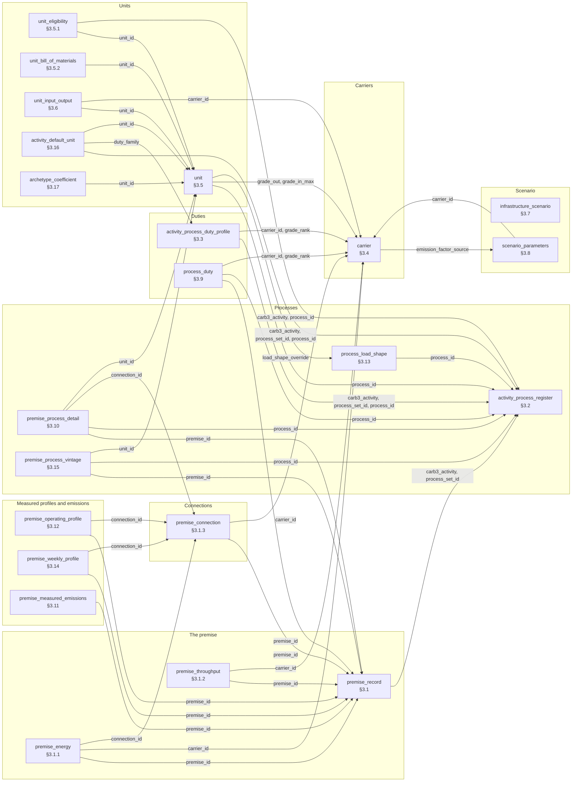

# Entity relationships

Generated from [the implementation specification](../2026-08-28-carb3-site-energy-system-implementation.md) by `docs/notes/examples/build_spec_flow_diagram.py`. Do not edit by hand — regenerate.

The 22 entities of §3 and the 40 relationships between them, read straight out of the field tables: the Key column supplies the primary keys, and an arrow to a table name in either the Key or the Validation column supplies the foreign keys. Nothing here is maintained by hand, so a foreign key added to the spec appears on the next regeneration and one removed disappears.

## How the tables relate

Read `A ||--o{ B` as *one A, many B*. `|{` on the child end marks an **identifying** relationship — the foreign key is part of B's own primary key, so a B cannot exist without its A. `|o` on the parent end marks a foreign key the child may leave unset.

A composite foreign key is drawn once, with its columns merged onto the label: 49 foreign-key columns become 40 arrows.

```mermaid
erDiagram
    activity_process_register |o--o{ premise_record : "carb3_activity, process_set_id"
    premise_record ||--|{ premise_energy : "premise_id"
    carrier ||--|{ premise_energy : "carrier_id"
    premise_connection |o--|{ premise_energy : "connection_id"
    premise_record ||--|{ premise_throughput : "premise_id"
    carrier ||--|{ premise_throughput : "carrier_id"
    premise_record ||--|{ premise_connection : "premise_id"
    carrier ||--o{ premise_connection : "carrier_id"
    activity_process_register ||--|{ activity_process_duty_profile : "carb3_activity, process_set_id, process_id"
    carrier |o--o{ activity_process_duty_profile : "carrier_id, grade_rank"
    scenario_parameters |o--o{ carrier : "emission_factor_source"
    activity_process_register |o--o{ unit : "process_id"
    carrier |o--o{ unit : "grade_out, grade_in_max"
    process_load_shape |o--o{ unit : "load_shape_override"
    unit ||--|{ unit_eligibility : "unit_id"
    activity_process_register ||--|{ unit_eligibility : "carb3_activity, process_id"
    unit ||--|{ unit_bill_of_materials : "unit_id"
    unit ||--|{ unit_input_output : "unit_id"
    carrier ||--|{ unit_input_output : "carrier_id"
    carrier |o--o{ scenario_parameters : "carrier_id"
    premise_record ||--|{ process_duty : "premise_id"
    activity_process_register ||--|{ process_duty : "process_id"
    carrier |o--o{ process_duty : "carrier_id, grade_rank"
    premise_record ||--|{ premise_process_detail : "premise_id"
    activity_process_register ||--|{ premise_process_detail : "process_id"
    premise_connection |o--o{ premise_process_detail : "connection_id"
    unit |o--o{ premise_process_detail : "unit_id"
    premise_record ||--|{ premise_measured_emissions : "premise_id"
    premise_record ||--|{ premise_operating_profile : "premise_id"
    premise_connection |o--|{ premise_operating_profile : "connection_id"
    activity_process_register ||--o{ process_load_shape : "process_id"
    premise_record ||--|{ premise_weekly_profile : "premise_id"
    premise_connection |o--|{ premise_weekly_profile : "connection_id"
    premise_record ||--|{ premise_process_vintage : "premise_id"
    activity_process_register ||--|{ premise_process_vintage : "process_id"
    unit |o--o{ premise_process_vintage : "unit_id"
    activity_process_register ||--|{ activity_default_unit : "carb3_activity, process_set_id, process_id"
    activity_process_duty_profile ||--|{ activity_default_unit : "duty_family"
    unit ||--|{ activity_default_unit : "unit_id"
    unit ||--|{ archetype_coefficient : "unit_id"
```

## By subject

The same graph, boxed by what each table holds data *about*. Cardinality is dropped here — the diagram above carries it — in exchange for the one thing an ER diagram cannot show: which tables describe the same subject. Arrows run from the table holding the foreign key to the table it points at, labelled with the column.

## Where each subject lives

One row per table, in the order §3 defines them.

| Subject | Table | § | What it is | Columns |
|---|---|---|---|---|
| The premise | `premise_record` | §3.1 | the premise itself | `latitude`, `longitude`, `nation`, `floorspace`, `construction_year`, `construction_year_band`, `last_refurbishment_year`, `data_year`, `source` |
|  | `premise_energy` | §3.1.1 | consumption by carrier | `vector`, `quantity`, `data_status`, `source` |
|  | `premise_throughput` | §3.1.2 | physical output by carrier | `quantity`, `data_status`, `source` |
| Connections | `premise_connection` | §3.1.3 | — | `import_capacity`, `export_capacity`, `connection_voltage`, `available_area` |
| Processes | `activity_process_register` | §3.2 | activity → processes | `set_name`, `is_default`, `process_name`, `is_optional`, `provenance` |
|  | `premise_process_detail` | §3.10 | known site processes and capacity | `valid_to_year`, `known_capacity`, `provenance`, `confidence` |
|  | `premise_process_vintage` | §3.15 | when the plant was installed (D11) | `commissioned_year`, `capacity_share`, `provenance`, `confidence` |
|  | `process_load_shape` | §3.13 | how a process presents its demand | `shape_class`, `duty_factor`, `peak_to_mean`, `runs_when_idle`, `seasonality`, `provenance`, `confidence` |
| Duties | `activity_process_duty_profile` | §3.3 | — | `duty_share`, `share_low`, `share_high`, `evidence_tier`, `provenance`, `confidence` |
|  | `process_duty` | §3.9 | — | `quantity`, `evidence_tier` |
| Carriers | `carrier` | §3.4 | — | `carrier_name`, `carrier_kind`, `is_gradeable`, `grade_rank`, `grade_label`, `is_indirect`, `denominator_kind` |
| Units | `unit` | §3.5 | — | `unit_name`, `unit_class`, `spine`, `duty_family`, `capex`, `fixed_opex`, `lifetime`, `availability_factor`, `capacity_to_activity_factor`, `area_per_capacity`, `emissions_released`, `min_viable_scale`, `is_hybrid`, `provenance`, `confidence` |
|  | `unit_eligibility` | §3.5.1 | — | `min_duty`, `max_share`, `earliest_year`, `provenance` |
|  | `unit_bill_of_materials` | §3.5.2 | — | `capacity_share`, `capex_share`, `component_lifetime`, `replacements_in_life` |
|  | `unit_input_output` | §3.6 | — | `coefficient`, `is_primary_output`, `is_reject` |
|  | `activity_default_unit` | §3.16 | — | `default_share`, `sizing_basis`, `evidence_tier`, `provenance`, `confidence` |
|  | `archetype_coefficient` | §3.17 | — | `psi`, `beta`, `chi`, `epsilon`, `evidence_tier`, `sizing_ratio` |
| Measured profiles and emissions | `premise_operating_profile` | §3.12 | schedule and load shape | `operating_pattern`, `operating_hours_per_year`, `operating_days_per_week`, `shutdown_weeks`, `peak_electricity`, `peak_gas`, `load_factor_electricity`, `load_factor_gas`, `within_shift_peak_factor`, `profile_basis`, `provenance`, `confidence` |
|  | `premise_weekly_profile` | §3.14 | measured shape, where it exists | `fraction_of_peak`, `annual_peak`, `provenance`, `confidence` |
|  | `premise_measured_emissions` | §3.11 | reported emissions, where they exist | `quantity`, `scope`, `provenance`, `confidence` |
| Scenario | `infrastructure_scenario` | §3.7 | exogenous availability (D7) | `available`, `capacity_limit`, `unit_tariff` |
|  | `scenario_parameters` | §3.8 | — | `value` |

## Every field

The full model. `PK` marks a primary-key part, `FK` a foreign key; each attribute is tagged `required` or `optional`. Enumerated types are shown as `enum` — their members are in the spec's Type column.

```mermaid
erDiagram
    activity_process_register |o--o{ premise_record : "carb3_activity, process_set_id"
    premise_record ||--|{ premise_energy : "premise_id"
    carrier ||--|{ premise_energy : "carrier_id"
    premise_connection |o--|{ premise_energy : "connection_id"
    premise_record ||--|{ premise_throughput : "premise_id"
    carrier ||--|{ premise_throughput : "carrier_id"
    premise_record ||--|{ premise_connection : "premise_id"
    carrier ||--o{ premise_connection : "carrier_id"
    activity_process_register ||--|{ activity_process_duty_profile : "carb3_activity, process_set_id, process_id"
    carrier |o--o{ activity_process_duty_profile : "carrier_id, grade_rank"
    scenario_parameters |o--o{ carrier : "emission_factor_source"
    activity_process_register |o--o{ unit : "process_id"
    carrier |o--o{ unit : "grade_out, grade_in_max"
    process_load_shape |o--o{ unit : "load_shape_override"
    unit ||--|{ unit_eligibility : "unit_id"
    activity_process_register ||--|{ unit_eligibility : "carb3_activity, process_id"
    unit ||--|{ unit_bill_of_materials : "unit_id"
    unit ||--|{ unit_input_output : "unit_id"
    carrier ||--|{ unit_input_output : "carrier_id"
    carrier |o--o{ scenario_parameters : "carrier_id"
    premise_record ||--|{ process_duty : "premise_id"
    activity_process_register ||--|{ process_duty : "process_id"
    carrier |o--o{ process_duty : "carrier_id, grade_rank"
    premise_record ||--|{ premise_process_detail : "premise_id"
    activity_process_register ||--|{ premise_process_detail : "process_id"
    premise_connection |o--o{ premise_process_detail : "connection_id"
    unit |o--o{ premise_process_detail : "unit_id"
    premise_record ||--|{ premise_measured_emissions : "premise_id"
    premise_record ||--|{ premise_operating_profile : "premise_id"
    premise_connection |o--|{ premise_operating_profile : "connection_id"
    activity_process_register ||--o{ process_load_shape : "process_id"
    premise_record ||--|{ premise_weekly_profile : "premise_id"
    premise_connection |o--|{ premise_weekly_profile : "connection_id"
    premise_record ||--|{ premise_process_vintage : "premise_id"
    activity_process_register ||--|{ premise_process_vintage : "process_id"
    unit |o--o{ premise_process_vintage : "unit_id"
    activity_process_register ||--|{ activity_default_unit : "carb3_activity, process_set_id, process_id"
    activity_process_duty_profile ||--|{ activity_default_unit : "duty_family"
    unit ||--|{ activity_default_unit : "unit_id"
    unit ||--|{ archetype_coefficient : "unit_id"
    premise_record {
    string premise_id PK "required"
    string carb3_activity FK "required"
    real latitude "required"
    real longitude "required"
    enum nation "required"
    real floorspace "optional"
    string process_set_id FK "optional"
    integer construction_year "optional"
    string construction_year_band "optional"
    integer last_refurbishment_year "optional"
    integer data_year "required"
    string source "required"
    }
    premise_energy {
    string premise_id PK,FK "required"
    string carrier_id PK,FK "required"
    string connection_id PK,FK "optional"
    enum vector "required"
    real quantity "required"
    enum data_status "required"
    integer data_year PK "required"
    string source "required"
    }
    premise_throughput {
    string premise_id PK,FK "required"
    string carrier_id PK,FK "required"
    real quantity "required"
    integer data_year PK "required"
    enum data_status "required"
    string source "required"
    }
    premise_connection {
    string premise_id PK,FK "required"
    string connection_id PK "required"
    string carrier_id FK "required"
    real import_capacity "optional"
    real export_capacity "optional"
    real connection_voltage "optional"
    real available_area "optional"
    }
    activity_process_register {
    string carb3_activity PK "required"
    string process_set_id PK "required"
    string set_name "required"
    boolean is_default "required"
    string process_id PK,FK "required"
    string process_name "required"
    boolean is_optional "required"
    string provenance "required"
    }
    activity_process_duty_profile {
    string carb3_activity PK,FK "required"
    string process_set_id PK,FK "required"
    string process_id PK,FK "required"
    enum duty_family PK "required"
    string carrier_id FK "required"
    integer grade_rank PK,FK "optional"
    real duty_share "required"
    real share_low "optional"
    real share_high "optional"
    enum evidence_tier "required"
    string provenance "required"
    enum confidence "required"
    }
    carrier {
    string carrier_id PK "required"
    string carrier_name "required"
    enum carrier_kind "required"
    boolean is_gradeable "required"
    integer grade_rank "optional"
    string grade_label "optional"
    boolean is_indirect "required"
    string emission_factor_source FK "optional"
    enum denominator_kind "required"
    }
    unit {
    string unit_id PK "required"
    string unit_name "required"
    enum unit_class "required"
    enum spine "required"
    string duty_family "optional"
    string process_id FK "optional"
    integer grade_out FK "optional"
    integer grade_in_max FK "optional"
    real capex "required"
    real fixed_opex "required"
    integer lifetime "required"
    real availability_factor "required"
    real capacity_to_activity_factor "required"
    real area_per_capacity "optional"
    real emissions_released "required"
    real min_viable_scale "optional"
    string load_shape_override FK "optional"
    boolean is_hybrid "required"
    string abates_unit_id FK "optional"
    enum provenance "required"
    enum confidence "required"
    }
    unit_eligibility {
    string unit_id PK,FK "required"
    string carb3_activity PK,FK "required"
    string process_id PK,FK "required"
    real min_duty "optional"
    real max_share "optional"
    integer earliest_year "optional"
    enum provenance "required"
    }
    unit_bill_of_materials {
    string unit_id PK,FK "required"
    string component_id PK "required"
    real capacity_share "required"
    real capex_share "required"
    integer component_lifetime "required"
    integer replacements_in_life "required"
    }
    unit_input_output {
    string unit_id PK,FK "required"
    string carrier_id PK,FK "required"
    real coefficient "required"
    boolean is_primary_output "required"
    boolean is_reject "required"
    }
    infrastructure_scenario {
    string scenario_id PK "required"
    enum carrier PK "required"
    string cluster_id PK "required"
    integer period PK "required"
    boolean available "required"
    real capacity_limit "optional"
    real unit_tariff "required"
    }
    scenario_parameters {
    string parameter_id PK "required"
    string carrier_id FK "optional"
    integer period PK "optional"
    real value "required"
    }
    process_duty {
    string premise_id PK,FK "required"
    string process_id PK,FK "required"
    integer period PK "required"
    string carrier_id FK "required"
    real quantity "required"
    integer grade_rank FK "optional"
    enum evidence_tier "required"
    }
    premise_process_detail {
    string premise_id PK,FK "required"
    string process_id PK,FK "required"
    integer valid_from_year PK "required"
    integer valid_to_year "optional"
    string connection_id FK "optional"
    real known_capacity "optional"
    string unit_id FK "optional"
    string provenance "required"
    enum confidence "required"
    }
    premise_measured_emissions {
    string premise_id PK,FK "required"
    integer emission_year PK "required"
    enum source_category PK "required"
    enum ghg PK "required"
    real quantity "required"
    enum scope "required"
    string provenance "required"
    enum confidence "required"
    }
    premise_operating_profile {
    string premise_id PK,FK "required"
    string connection_id PK,FK "optional"
    integer profile_year PK "required"
    enum operating_pattern "optional"
    real operating_hours_per_year "optional"
    real operating_days_per_week "optional"
    real shutdown_weeks "optional"
    real peak_electricity "optional"
    real peak_gas "optional"
    real load_factor_electricity "optional"
    real load_factor_gas "optional"
    real within_shift_peak_factor "optional"
    enum profile_basis "required"
    string provenance "required"
    enum confidence "required"
    }
    process_load_shape {
    string shape_id PK "required"
    string process_id FK "required"
    enum shape_class "required"
    real duty_factor "required"
    real peak_to_mean "required"
    boolean runs_when_idle "required"
    enum seasonality "required"
    string provenance "required"
    enum confidence "required"
    }
    premise_weekly_profile {
    string premise_id PK,FK "required"
    string connection_id PK,FK "optional"
    integer profile_year PK "required"
    enum vector PK "required"
    string process_id PK "optional"
    enum season PK "required"
    integer interval_index PK "required"
    real fraction_of_peak "required"
    real annual_peak "required"
    string provenance "required"
    enum confidence "required"
    }
    premise_process_vintage {
    string premise_id PK,FK "required"
    string process_id PK,FK "required"
    string cohort_id PK "required"
    string unit_id FK "optional"
    integer commissioned_year "required"
    real capacity_share "required"
    string provenance "required"
    enum confidence "required"
    }
    activity_default_unit {
    string carb3_activity PK,FK "required"
    string process_set_id PK,FK "required"
    string process_id PK,FK "required"
    string duty_family PK,FK "required"
    string unit_id PK,FK "required"
    real default_share "required"
    enum sizing_basis "required"
    enum evidence_tier "required"
    string provenance "required"
    enum confidence "required"
    }
    archetype_coefficient {
    string archetype_id PK "required"
    string unit_id PK,FK "required"
    real psi "optional"
    real beta "optional"
    real chi "optional"
    real epsilon "optional"
    enum evidence_tier "required"
    real sizing_ratio "optional"
    }
```

