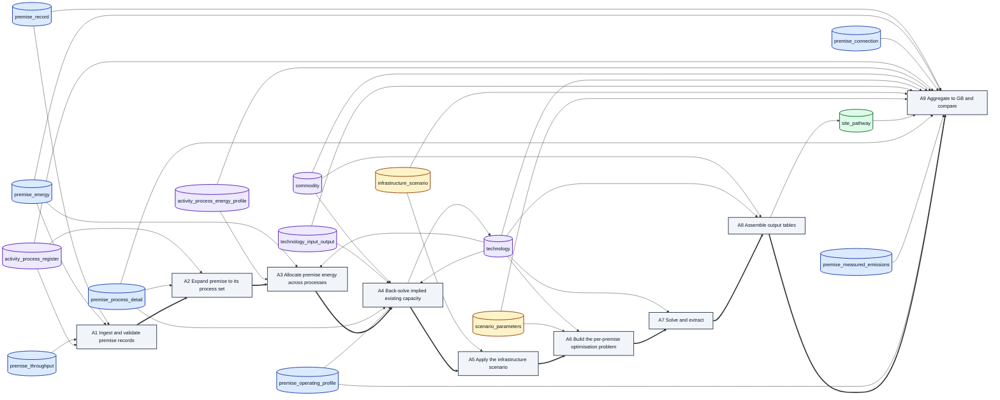

# CaRB3 per-site model — data flow

Generated from [the implementation specification](../2026-08-19-carb3-site-decarbonisation-implementation.md) by `docs/notes/examples/build_spec_flow_diagram.py`. Do not edit by hand — regenerate.

15 entities · 9 algorithms · 44 edges. Cylinders are data, boxes are algorithms; dashed edges are reads, solid are writes and the pipeline order. Colour marks who owns the data — see [the README](README.md).

