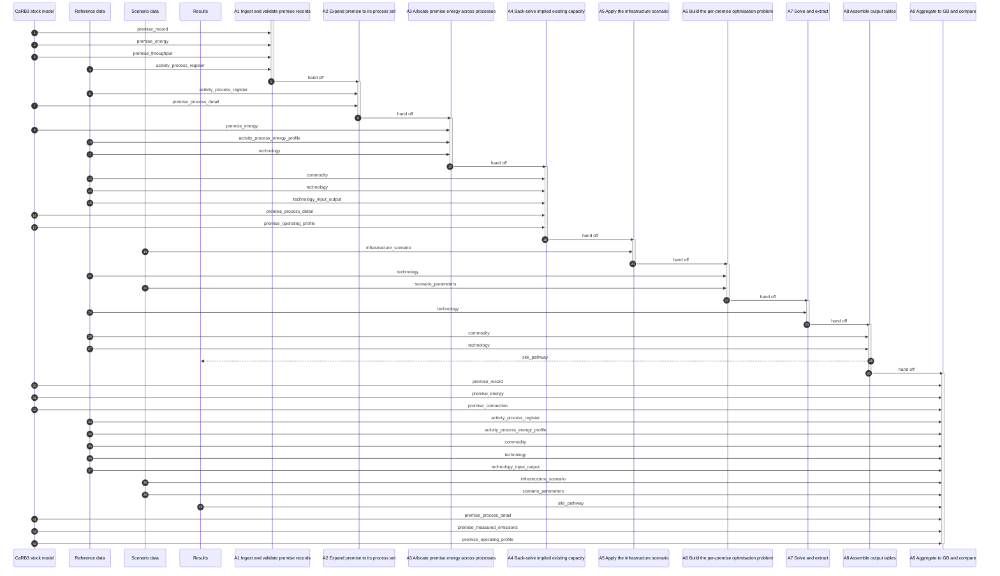

# The journey of one premise

Generated from [the implementation specification](../2026-08-19-carb3-site-decarbonisation-implementation.md) by `docs/notes/examples/build_spec_flow_diagram.py`. Do not edit by hand — regenerate.

What happens to a single premise between arriving from the stock model and leaving as a pathway. 9 steps, in the order §4 specifies them. Data stores are grouped into four lanes by who owns them — the entity name travels on the arrow, so nothing is lost. Solid arrows into a step are reads; dashed arrows out are writes.

